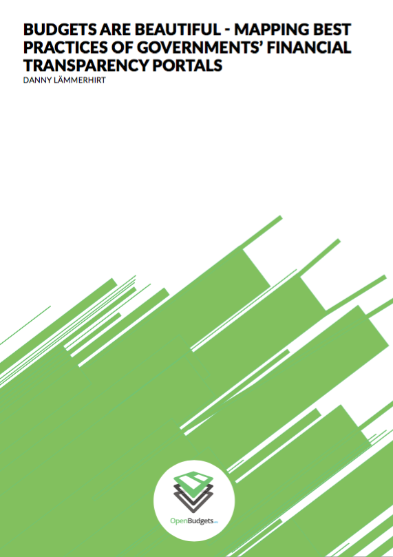

Governments around the world increasingly embrace values of fiscal transparency and a first step in being more open is developing open spending platforms. OpenBudgets.eu has taken it upon itself to support governments with the publication, visualisation and analysis of fiscal data. 

We have conducted six semi-structured interviews with government officials on different government levels, as well as organisations providing governments with so- lutions to publish, visualize and analyze fiscal data. Afterwards, we analyzed the challenges encountered by these actors when publishing and visualizing fiscal data. From these findings, we extracted best practices for translating data, developing comparative tools, visualisations, and interacting with actors within and outside of the govern- ment to allow for the publication of fiscal data.

<tbody><tr style="border: none"><td style="border: none">
</td>
<td style="vertical-align:middle; border:none;">
<ul>
<li><h5><a target="_blank" href="http://openbudgets.eu/assets/resources/Report-Laemmerhirt-Making-Budgets-Attractive.pdf">Download as PDF</a>.</h5></li>
