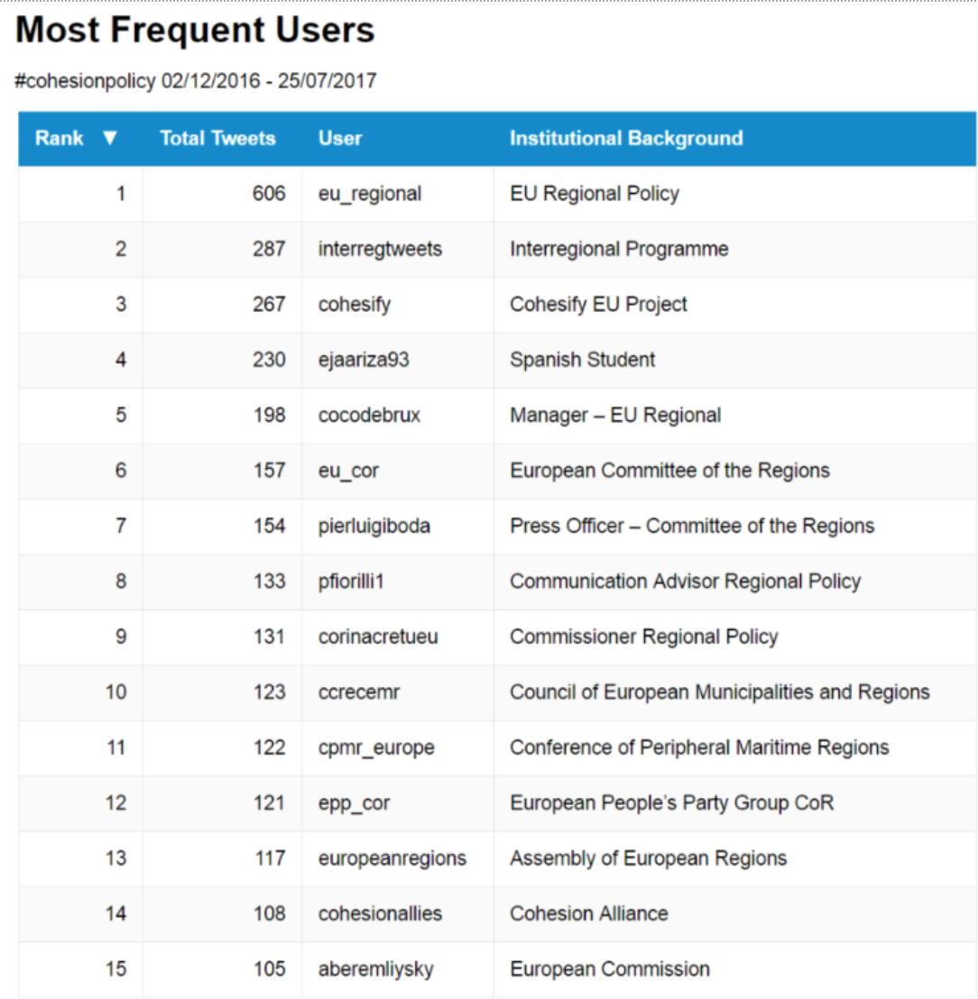
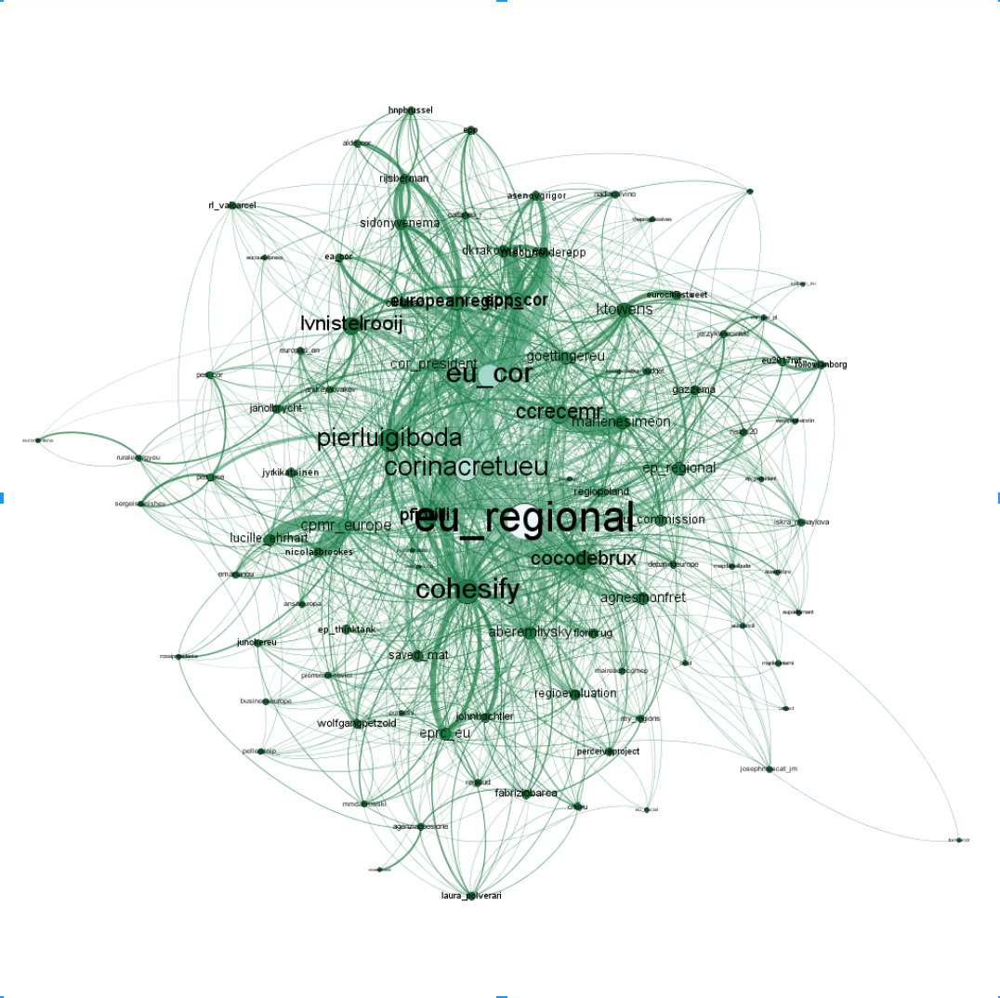

**What Twitter tells us about #cohesionpolicy**

As part of our OpenBudgets.eu research we collected twitter data to get an idea of the stakeholders regarding the EU Structural Funds. The analysis was focused on all tweets with the hashtag #cohesionpolicy starting on December 12, 2016 until July 25, 2017. We chose the #cohesionpolicy, because it is the overarching term in relation to the EU Structural Funds.

Overall this lead to a dataset of 11291 tweets, while 8719 of those included links and 755 with media uploads. Furthermore, 8796 of those were retweets, while 10085 tweets mentioned another user and only 74 tweets were sent in reply. If we subtract the number of tweets from the retweets (11291 - 8796) it leaves us with 2495 original tweets. This leads us to the general hypothesis that the hashtag #cohesionpolicy is centered around a few major accounts that publish the tweets.

**Tweet Frequency Timeline**
Figure 1 shows us a plot of the timeline and the tweet frequency, which is an interesting aspect of twitter data analysis. Often specific increases in tweet frequencies, signal a certain event taking place or important news being released. When looking at the frequency of the hashtag #cohesionpolicy over time we can clearly see spikes at certain dates which hint that something relevant must have happened. By looking at the exact dates and doing some additional research we can explain why they occurred.

One of the earliest spikes in tweet frequencies came in late January and can be directly attributed to the January 24 workshop by the European Parliament’s REGI committee on “Building building blocks of a future cohesion policy”. The next larger uptake is centered around [February 9](http://europa.eu/rapid/press-release_MEX-17-256_en.htm?locale=en), when DG Region Commissioner Corina Cretu visited Italy and stressed the readiness of the structural funds for reconstruction process after the earthquakes. The high tweet frequency (253) on March 2 was due to the Committee of the Regions (CoR) external meeting and conference on "The Future of Cohesion Policy beyond 2020". On April 25 the Council of the European Union adopted its [conclusions](http://ec.europa.eu/regional_policy/en/newsroom/news/2017/04/25-04-2017-making-cohesion-policy-more-visible) on making cohesion policy more effective, relevant and visible to the citizens, which lead to 236 tweets.

The second highest peak of tweets (677) took place on May 18 during the CoR event on [Alliance on the Future of Cohesion Policy](http://cor.europa.eu/en/events/Pages/cohesion-policy-eu.aspx). The bunching that can be seen between June 13-16 was due to the adoption of the ESIF resolution in the European Parliament’s plenary sessions. However, the highest peak of tweets was during the [7th Cohesion Forum](http://ec.europa.eu/regional_policy/en/newsroom/news/2017/05/29-05-2017-7th-cohesion-forum), which took place on June 26 - 27 in Brussels. The event was considered a milestone in the preparations for the post-2020 framework for the European Structural and Investment Funds. On the first day of the conference 792 tweets were sent out, while the second day totaled 646. This shows that large events such as conferences are occasions when Twitter and the corresponding hashtags are used very frequently - both days of the forum account for 12.7% of our overall tweets.

**Users and their Networks**

Next we focus our analysis on the most frequent users and their networks. The table below shows, the top 15 users of #cohesionpolicy throughout the last 7 months. A clear pattern of EU actors and institutions emerges, that is only stopped by user ejaariza93 who appears to be a Spanish university student with a high interest in cohesion policy. The distribution appears rather top-heavy with the top 10 users accounting for 20.2% of the overall tweets, this hints at a few key accounts dominating the twitter scene around #cohesionpolicy.

Furthermore, we undertook a network analysis using Gephi. We analysed which users had the highest centrality within the network, measured by the most tweets and retweets. As you can see there are several nodes (dots), which equal each user. Some of those nodes are larger, indicating that they are more important network hubs within the #cohesionpolicy community. The edges (lines) show how connected each account is with the others, if they mentioned each other or replied the edges grow darker. The most important users are also indicated by the size of their name. Similar to our most frequent users list, we can see that the twitter accounts of EU Regional Policy, Cohesify, Corina Cretu, Pierluigi Boda and European Committee of the Regions function as network hubs within the #cohesionpolicy community.

The most common co-hashtags are #eu7cf, #EU, #CohesionAlliance, #EUbudget, #FutureofEurope and #EUbudget again show the EU-centeredness of #cohesionpolicy. This holds equally for the most frequently used words (ignoring capitalization) “eu”, “regional”, “corinacretueu”, “future” and “europe”. Analysing the most tweeted images again shows that the #cohesionpolicy hashtag is mostly used by EU institutions. The most frequently tweeted picture was [this](https://pbs.twimg.com/media/DDQTGx9XsAAkz60.jpg) photo of Günther Oettinger the German EU Commissioner for Budget & Human Resources. Similarly, the second most tweeted photo is of [Corina Cretu](https://pbs.twimg.com/media/C5bwVrTXQAAB_F3.jpg) the Romanian EU Commissioner for Regional Policy.

The in depth analysis of the hashtag #cohesionpolicy showed, that Twitter can provide an excellent timeline for tracking political events. The use of #cohesionpolicy is strongest among EU institutions, which is not really surprising since it stands in reference to  one of the EU’s official financing mechanisms. Furthermore, the networking between EU institutions such as the EC’s Directorate General, the European Parliament and the Committee of the Regions is strong on Twitter.
