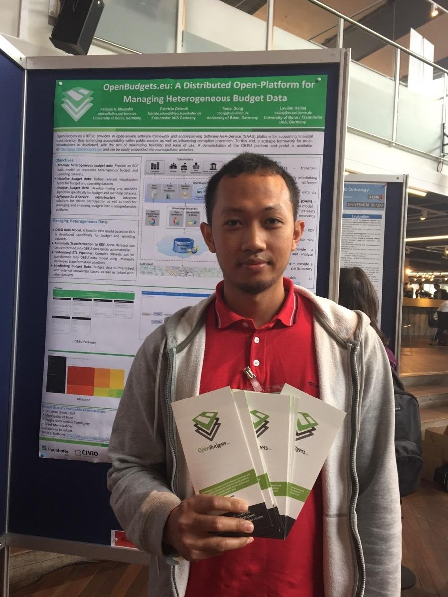
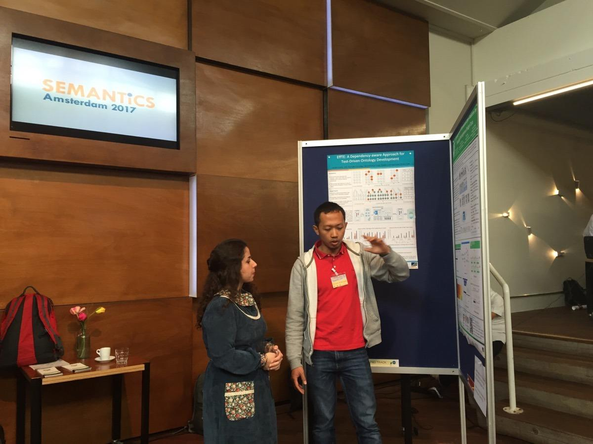
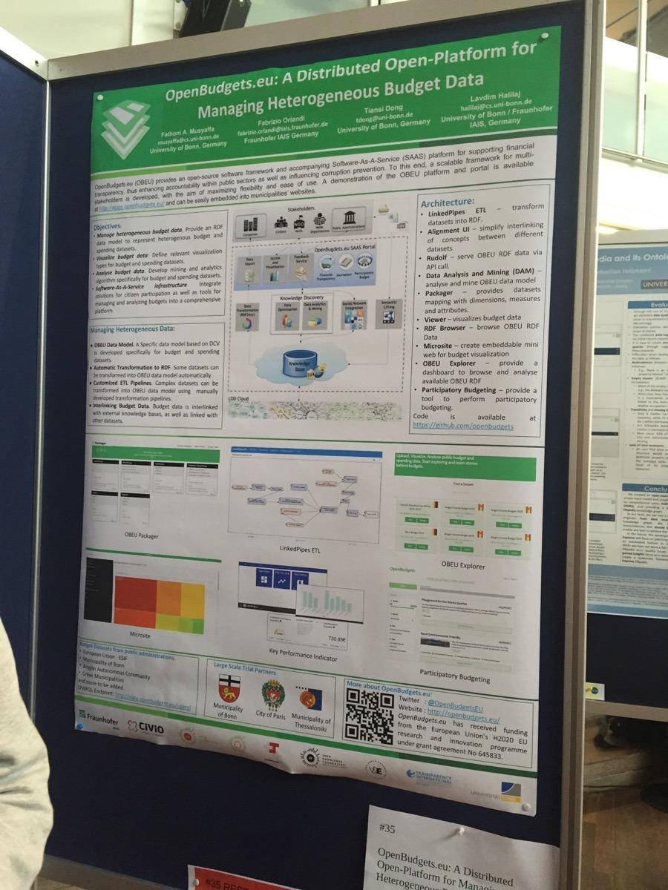
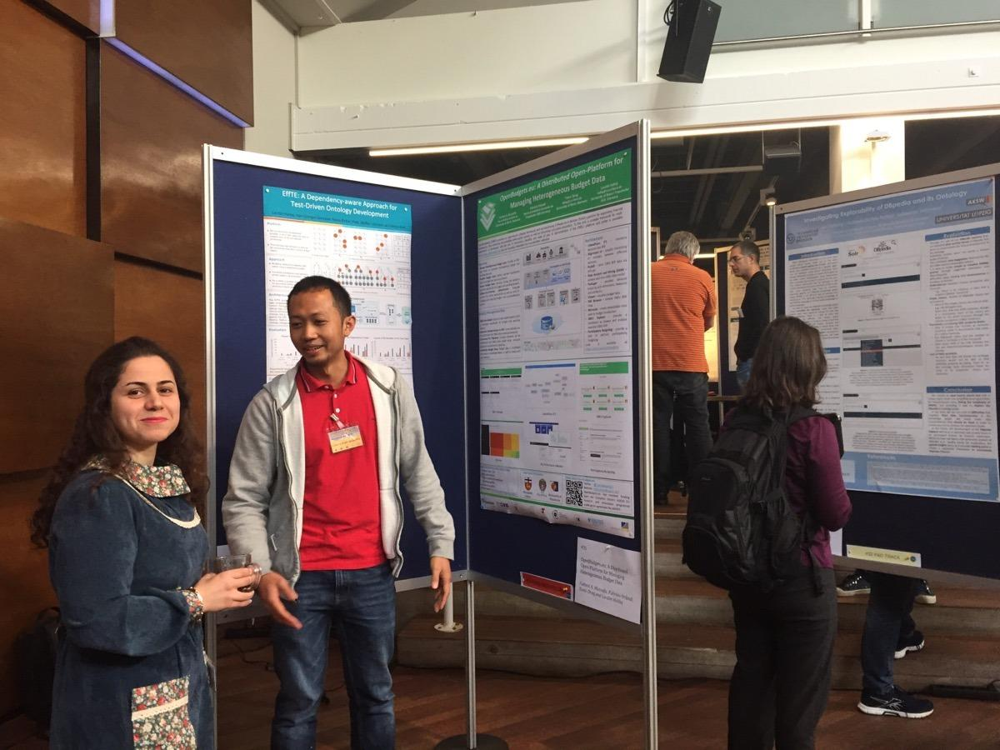
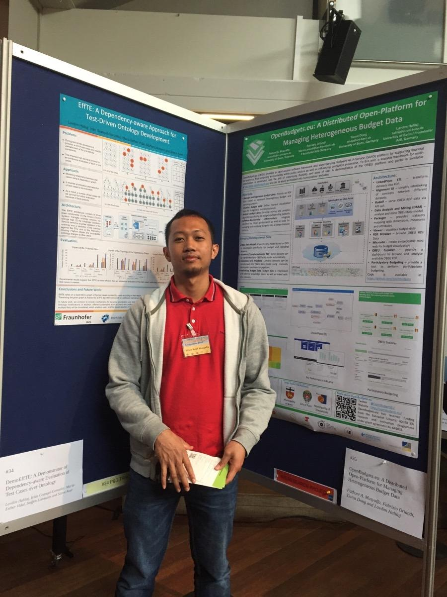
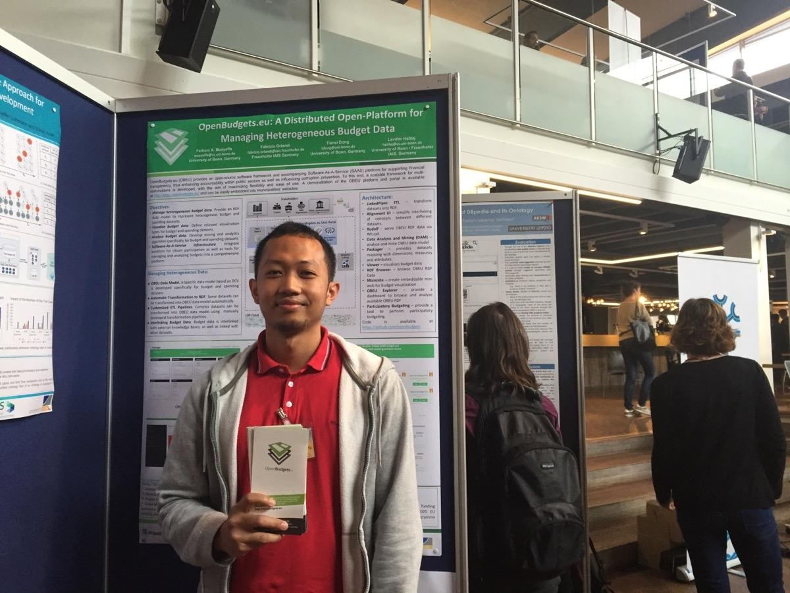

OpenBudgets.eu was launched in the first week of September and presented at the annual SEMANTiCS conference in Amsterdam. The annual SEMANTiCS conference is the meeting place for professionals who make semantic computing work, and understand its benefits and know its limitations. Every year, SEMANTiCS attracts information managers, IT-architects, software engineers, and researchers, from organisations ranging from NPOs, universities, public administrations to the largest companies in the world.

This year SEMANTiCs took place in Amsterdam on September 11-14, 2017, and gathered 370 participants in the field of semantic technologies. The Openbudgets.eu (OBEU) project was proud to sponsor of this years SEMANTiCS. The project was represented by partners from Open Knowledge Greece, University of Bonn, Fraunhofer IAIS, and the University of Economics Prague and presented the work in a poster session. 

In the poster session, the representatives of OBEU explained the main goals and findings of the project. The audience had a keen interest in the semantic tools as developed by in OpenBudgets.eu as well as the resulting datasets. Semantic budget datasets and the underlying data model can also be used for other use cases and new visualisations of the budget data, its properties and entities. With the launch of OpenBudgets.eu, the SPARQL data endpoint is now also public, so the linked datasets can be explored and queried over the data endpoint: [http://data.openbudgets.eu/sparql](http://data.openbudgets.eu/sparql) . 

Beyond the advances in the field of semantic data and linking budget data to the semantic web, many of the tools developed in OpenBudgets.eu have a wider application than merely the budget domain. A prime example is the tool: "LinkedPipes". This Extract - Transform - Load (ETL) tool was developed to handle ETL pipeline for our fiscal data which were processed for the project. The application is much broader and the LinkedPipes ETL makes significant improvement to transform raw data to semantic formats. 

This and other findings will be presented in the poster paper that will be published under the CEUR workshop proceedings series. 

 

